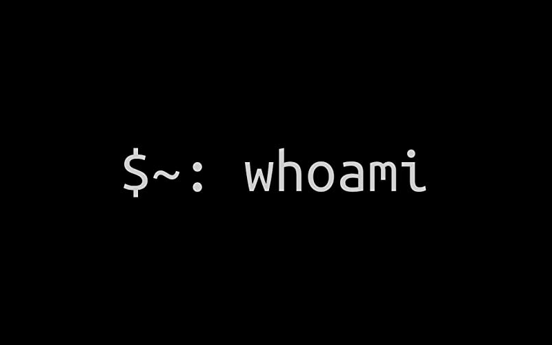

## init 0x00

### Summary:
Welcome to **My Hacking Diaries**.  
This is where I write down every note, trick, or idea I come across while learning and practicing offensive security. 
Some notes might come from **HackTheBox** machines, bug bounty hunting, enumeration tips, privilege escalation tricks, or reverse engineering challenges. 
Others might be things I learn from programming, scripting, or random CTF problems. 
I’m mainly writing these for myself because I forget things quickly but I also hope they’ll help beginners, or anyone stuck and needing a hint. At the end of the day, everything here is part of the bigger journey in hacking and offensive security.

---

### HackTheBox Notes:  
**_Date : 27/04/2025_**

