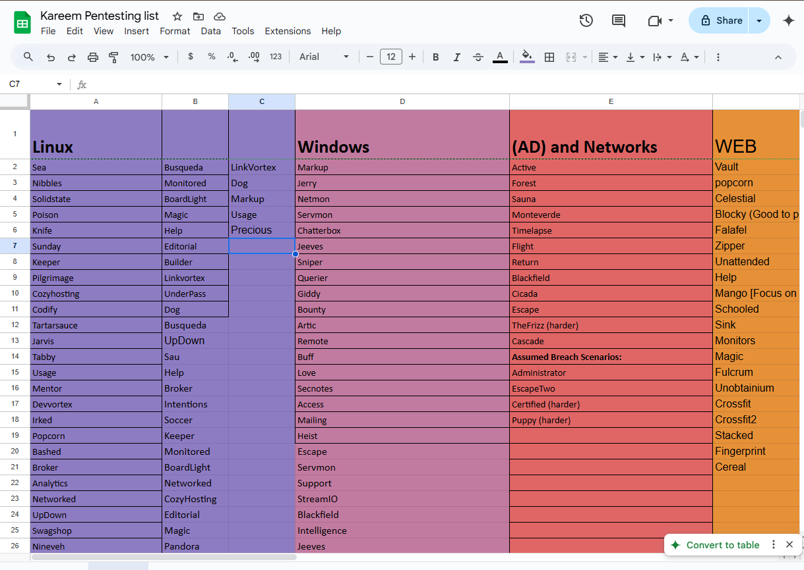

# Kareem's List

We will start solving machines from this list and will write writeup for each machine and with stuff i learned from it and also i will write every new trick in my hacking diaries 
[Check the full list](https://docs.google.com/spreadsheets/d/13DTGfemxzY2wLwfyQiGVCYDJ_DojLoy_u7sZpMsnPbI/edit?gid=0#gid=0)\
So Let's Get started :

# Linux machines :
[Sea-Machine](./1337-01-01-Sea)
