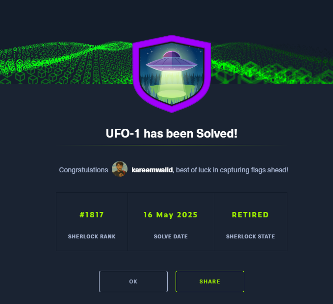

# Sherlocks UFO-1 HTB Writeup 


Sherlock Scenario :
```text
Being in the ICS Industry, your security team always needs to be up to date and should be aware of the threats targeting organizations in your industry. You just started as a Threat intelligence intern, with a bit of SOC experience. Your manager has given you a task to test your skills in research and how well can you utilize Mitre Att&ck to your advantage. Do your research on Sandworm Team, also known as BlackEnergy Group and APT44. Utilize Mitre ATT&CK to understand how to map adversary behavior and tactics in actionable form. Smash the assessment and impress your manager as Threat intelligence is your passion.
```