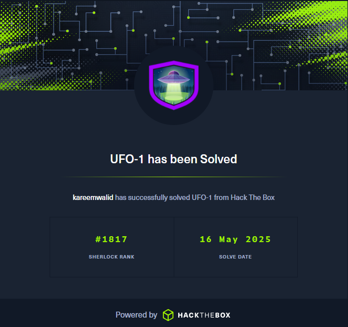

Sherlock Scenario :

`Being in the ICS Industry, your security team always needs to be up to date and should be aware of the threats targeting organizations in your industry. You just started as a Threat intelligence intern, with a bit of SOC experience. Your manager has given you a task to test your skills in research and how well can you utilize Mitre Att&ck to your advantage. Do your research on Sandworm Team, also known as BlackEnergy Group and APT44. Utilize Mitre ATT&CK to understand how to map adversary behavior and tactics in actionable form. Smash the assessment and impress your manager as Threat intelligence is your passion.`

-------------------
Task 1 : \
`According to the sources cited by Mitre, in what year did the Sandworm Team begin operations?`\
Answer According to mitre website is : 2009

------
Task 2 :\
`Mitre notes two credential access techniques used by the BlackEnergy group to access several hosts in the compromised network during a 2016 campaign against the Ukrainian electric power grid. One is LSASS Memory access (T1003.001). What is the Attack ID for the other?`\
Answer : \
`T1110`

-----
Task 3 :\
`During the 2016 campaign, the adversary was observed using a VBS script during their operations. What is the name of the VBS file?` \
Answer : \
`ufn.vbs`

------------------------------------------------------
Task 4 :\
`The APT conducted a major campaign in 2022. The server application was abused to maintain persistence. What is the Mitre Att&ck ID for the persistence technique was used by the group to allow them remote access?`\
Answer :\
`T1505.003` \

------------------------------------------
Task 5 :\
`What is the name of the malware / tool used in question 4?`
Answer :
`Neo-REGEORG`

-----
Task 6 :\
`Which SCADA application binary was abused by the group to achieve code execution on SCADA Systems in the same campaign in 2022?`
Answer :
`scilc.exe`

-----
Task 7 :\
`Identify the full command line associated with the execution of the tool from question 6 to perform actions against substations in the SCADA environment.`
Answer :
`C:\sc\prog\exec\scilc.exe -do pack\scil\s1.txt`

-----
Task 8 :\
`What malware/tool was used to carry out data destruction in a compromised environment during the same campaign?`
Answer :
`CaddyWiper`

-----
Task 9 :\
`The malware/tool identified in question 8 also had additional capabilities. What is the Mitre Att&ck ID of the specific technique it could perform in Execution tactic?`
Answer :
`T1106`

-----
Task 10 :\
`The Sandworm Team is known to use different tools in their campaigns. They are associated with an auto-spreading malware that acted as a ransomware while having worm-like features. What is the name of this malware?`
Answer :
`NotPetya`

-----
Task 11 :\
`What was the Microsoft security bulletin ID for the vulnerability that the malware from question 10 used to spread around the world?`
Answer :
`MS17-010`

-----
Task 12 :\
`What is the name of the malware/tool used by the group to target modems?`
Answer :
`AcidRain`

-----
Task 13 :\
`Threat Actors also use non-standard ports across their infrastructure for Operational-Security purposes. On which port did the Sandworm team reportedly establish their SSH server for listening?`
Answer :
`6789`

-----
Task 14 :\
`The Sandworm Team has been assisted by another APT group on various operations. Which specific group is known to have collaborated with them?`
Answer :
`APT28`

