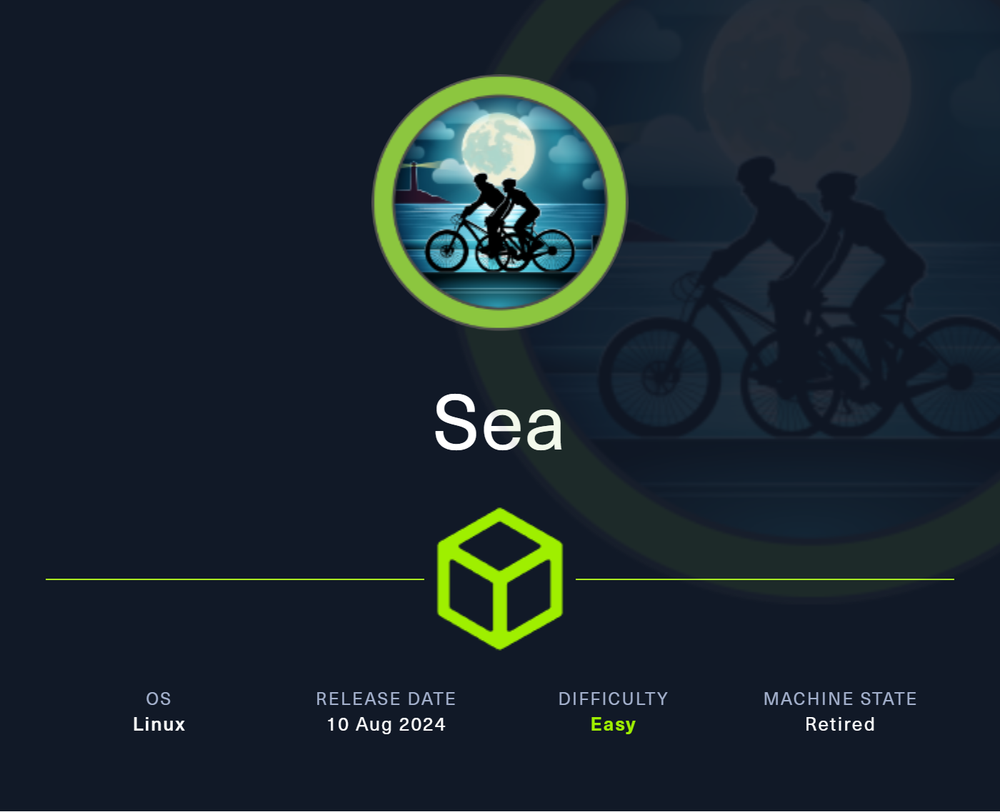
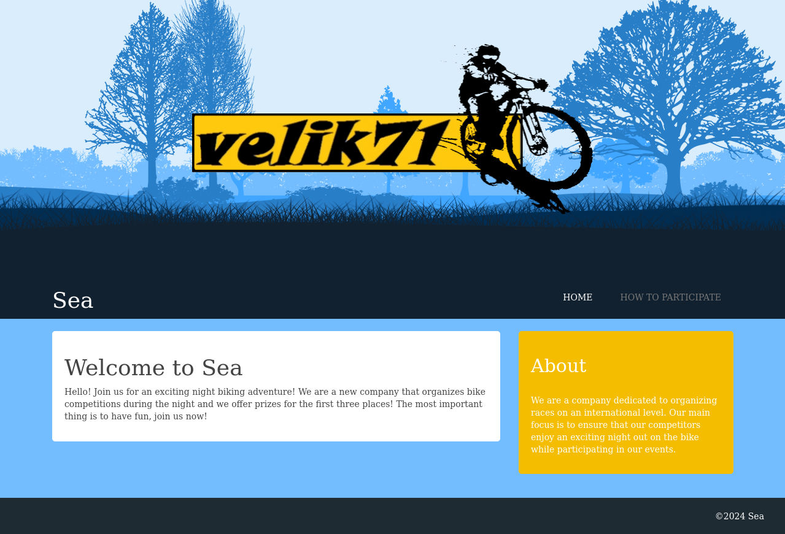
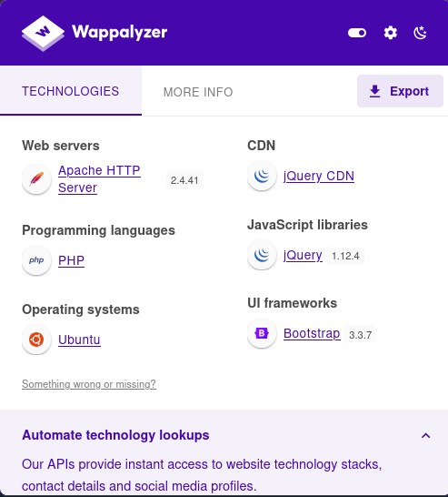
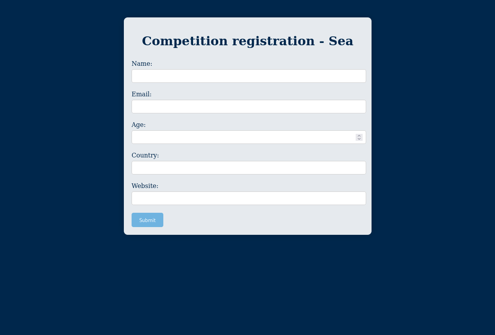

# Enumeration
```bash
┌──(kareem㉿Kali)-[~/sea]
└─$ nmap -sVC 10.10.11.28 
Starting Nmap 7.95 ( https://nmap.org ) at 2025-06-17 05:23 EEST
Nmap scan report for 10.10.11.28
Host is up (0.16s latency).
Not shown: 998 closed tcp ports (reset)
PORT   STATE SERVICE VERSION
22/tcp open  ssh     OpenSSH 8.2p1 Ubuntu 4ubuntu0.11 (Ubuntu Linux; protocol 2.0)
| ssh-hostkey: 
|   3072 e3:54:e0:72:20:3c:01:42:93:d1:66:9d:90:0c:ab:e8 (RSA)
|   256 f3:24:4b:08:aa:51:9d:56:15:3d:67:56:74:7c:20:38 (ECDSA)
|_  256 30:b1:05:c6:41:50:ff:22:a3:7f:41:06:0e:67:fd:50 (ED25519)
80/tcp open  http    Apache httpd 2.4.41
Service Info: Host: sea.htb; OS: Linux; CPE: cpe:/o:linux:linux_kernel

Service detection performed. Please report any incorrect results at https://nmap.org/submit/ .
Nmap done: 1 IP address (1 host up) scanned in 108.73 seconds
```
Okay now we see only ssh and http so lets try to access the website from the browser \
We got this cool looking site 

if we checked with wappalyzer we will find it was wrote using PHP
 \
We also found contact.php page 

Let's try to dir brute force using gobuster
```bash
┌──(kareem㉿Kali)-[~/sea]
└─$ gobuster dir -u http://sea.htb/ -w /usr/share/wordlists/dirbuster/directory-list-2.3-medium.txt -x txt,asp,aspx,html
===============================================================
Gobuster v3.6
by OJ Reeves (@TheColonial) & Christian Mehlmauer (@firefart)
===============================================================
[+] Url:                     http://sea.htb/
[+] Method:                  GET
[+] Threads:                 10
[+] Wordlist:                /usr/share/wordlists/dirbuster/directory-list-2.3-medium.txt
[+] Negative Status codes:   404
[+] User Agent:              gobuster/3.6
[+] Extensions:              asp,aspx,html,txt
[+] Timeout:                 10s
===============================================================
Starting gobuster in directory enumeration mode
===============================================================
/.html                (Status: 403) [Size: 199]
/home                 (Status: 200) [Size: 3650]
/0                    (Status: 200) [Size: 3650]
/themes               (Status: 301) [Size: 230] [--> http://sea.htb/themes/]
/data                 (Status: 301) [Size: 228] [--> http://sea.htb/data/]
/plugins              (Status: 301) [Size: 231] [--> http://sea.htb/plugins/]
/messages             (Status: 301) [Size: 232] [--> http://sea.htb/messages/]
/404                  (Status: 200) [Size: 3341]
```
