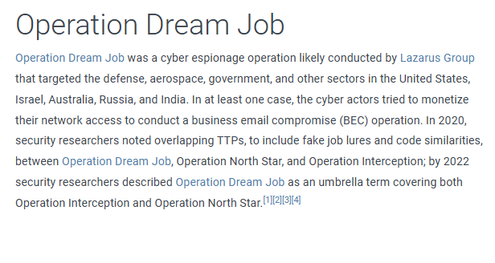

# challenge Description 
`You are a junior threat intelligence analyst at a Cybersecurity firm. You have been tasked with investigating a Cyber espionage campaign known as Operation Dream Job. The goal is to gather crucial information about this operation.`

# Solution 

- First Task "Who conducted Operation Dream Job?"
>Lazarus Group



- Second Task "When was this operation first observed?"
>September 2019

- Third Task "There are 2 campaigns associated with Operation Dream Job. One is Operation North Star, what is the other?"
>Operation Interception

Source : 
```Operation Dream Job was a cyber espionage operation likely conducted by Lazarus Group that targeted the defense, aerospace, government, and other sectors in the United States, Israel, Australia, Russia, and India. In at least one case, the cyber actors tried to monetize their network access to conduct a business email compromise (BEC) operation. In 2020, security researchers noted overlapping TTPs, to include fake job lures and code similarities, between Operation Dream Job, Operation North Star, and Operation Interception; by 2022 security researchers described Operation Dream Job as an umbrella term covering both Operation Interception and Operation North Star.```

- Fourth Task " During Operation Dream Job, there were the two system binaries used for proxy execution. One was Regsvr32, what was the other?"
>Rundll32

Source from ESET_Operation_Interception.pdf for 

- Fifth Task "What lateral movement technique did the adversary use?"
>internal spearphishing

- Sixth Task "What is the technique ID for the previous answer?"
>T1534

- Seventh Task "What Remote Access Trojan did the Lazarus Group use in Operation Dream Job?"
>DRATzarus

Source : 
For Operation Dream Job, Lazarus Group developed custom tools such as Sumarta, DBLL Dropper, Torisma, and DRATzarus for their operations.

- Eighth Task "What technique did the malware use for execution?"
>Native API

- Ninth Task "What technique did the malware use to avoid detection in a sandbox?"
>Time Based Evasion

- Tenth Task "To answer the remaining questions, utilize VirusTotal and refer to the IOCs.txt file. What is the name associated with the first hash provided in the IOC file?"
>IEXPLORE.exe

- Eleventh Task "When was the file associated with the second hash in the IOC first created?"
>2020-05-12 19:26:17

- Twelve Task "What is the name of the parent execution file associated with the second hash in the IOC?"
>BAE_HPC_SE.iso

- Thirteenth task "Examine the third hash provided. What is the file name likely used in the campaign
that aligns with the adversary's known tactics?"
>Salary_Lockheed_Martin_job_opportunities_confidential.doc

- Fourteenth Task "Which URL was contacted on 2022-08-03 by the file associated with the third hash in
the IOC file?"
>https://markettrendingcenter.com/lk_job_oppor.docx

https://labs.hackthebox.com/achievement/sherlock/24266/865