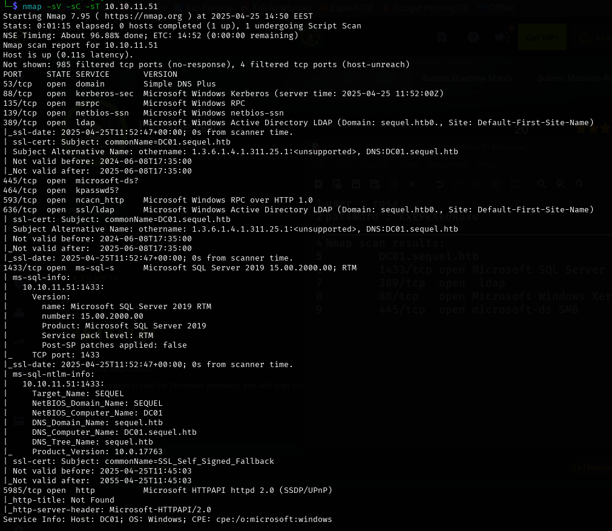

## 📝 Description

As is common in real-life Windows pentests, we begin this box with pre-given credentials:

**Username:** `rose`  
**Password:** `KxEPkKe6R8su`

---

## 🔍 Enumeration

We'll start with a basic **Nmap** scan using the following command:

```bash
nmap -sC -sV -sT 10.10.11.51
```

we will notice this valuable info 
```
DC01.sequel.htb
1433/tcp open  Microsoft SQL Server
389/tcp  open  LDAP
88/tcp   open  Microsoft Windows Kerberos
445/tcp  open  Microsoft-ds SMB
```
_The rest of the writeup will be available since the machine is still active_
